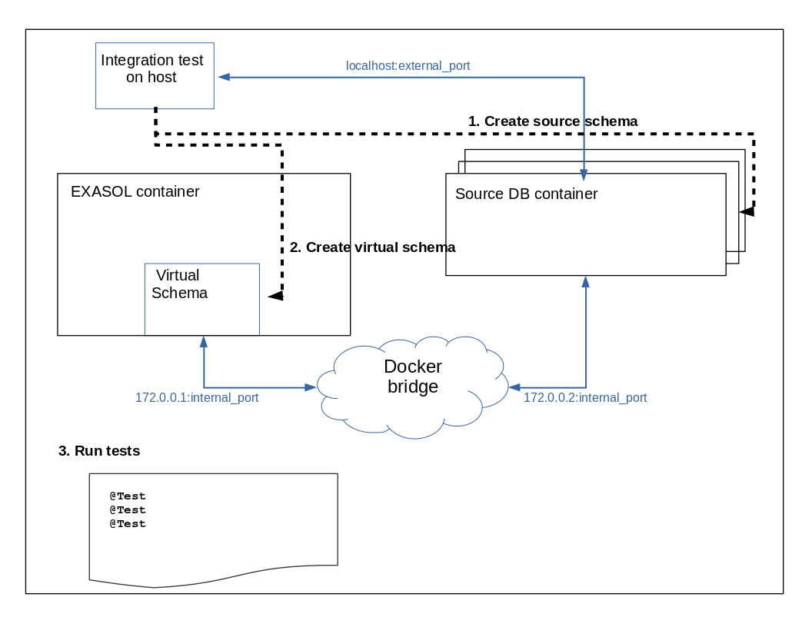

# Integration Testing with Containers

Virtual Schema integration tests use the `exasol-testcontainers` framework, which requires docker privileged mode to be available to run the tests.

## Overview

The idea of the container based tests is:
* Run the EXASOL and source databases in containers
* Prepare the test schema in the source database
* Create a virtual schema for the source database
* Run the tests on the virtual schema



## Prerequisites

What you need is, for each source database:

* A docker image with user you can connect to
* A JDBC driver for the database

## Preparing Integration Test

1. In order to run the automated integration test, add the test to the includes list of the `maven-failsafe-plugin` in the [pom file](../../../pom.xml).
2. Provide a JDBC driver JAR for the source database.
3. Add a new Integration Test class for you database

### Provide JDBC drivers for the Source Database

The JDBC drivers are automatically deployed during the test. You have to create a directory for the JDBC driver under `src/test/resources/integration/driver`. 
The folder contains the driver jar file(s) and a `settings.cfg` file (for any integration test except Exasol and Postgres).
In order to connect to the source database from your integration test you also have to add the jdbc driver dependency to the [POM](../../../pom.xml) scope verify.

### Add a new Integration Test Class

Add a new class that has to:
* Create the test schema in the source database
* Create the virtual schema
* Execute the tests on the virtual schema
See [PostgreSQLDialectIT](../../../src/test/java/com/exasol/adapter/dialects/postgresql/PostgreSQLSqlDialectIT.java) for an example.

## Security Considerations

In order not to create security issues make sure the data in the source database is not confidential (demo data only).

## Executing Enabled Integration Tests

We use following [Maven life cycle phases](https://maven.apache.org/guides/introduction/introduction-to-the-lifecycle.html) for our integration tests:

* `pre-integration-test` phase is used to **automatically deploy the latest [JDBC](https://www.exasol.com/support/secure/attachment/66315/EXASOL_JDBC-6.1.rc1.tar.gz) adapter JAR** (based on your latest code modifications)
* `integration-test` phase is used to execute the actual integration tests

Note that to check whether the integration-tests were successful, you have to run the verify Maven phase.

You can start the integration tests as follows:

```bash
mvn clean package && mvn verify
```

This will run all tests included in the `maven-failsafe-plugin` integration test configuration.

Another way to run integration tests:

* Create a package of Virtual Schemas using `mvn package` command and run integration tests inside your IDE in the same way as unit tests.

List of enabled integration tests:

* ExasolSqlDialectIT
* PostgreSQLSqlDialectIT


## Executing Disabled Integration Tests

Some integration tests are not running automatically, but it is possible to execute them locally. 
The reason for the tests being disabled is we can only deliver drivers where the license allows redistribution.
Therefore we cannot include some jdbc drivers to the projects and you need to download them manually for local integration testing.

List of disabled integration tests:

* OracleSqlDialectIT

How to start `OracleSqlDialectIT`:

1. Download Oracle JDBC driver `ojdbc8.jar` and oracle instant client `instantclient-basic-linux.x64-12.1.0.2.0.zip` and temporary put them into `src/test/resources/integration/driver/oracle` directory.
2. Run the tests from an IDE or temporarily add `OracleSqlDialectIT.java` into the `maven-failsafe-plugin` includes section and execute  `mvn verify` command.
3. Remove the driver and the instant client after the test. Do not upload them to the GitHub repository.

## See also

* [Developing an SQL dialect](developing_a_dialect.md)
* [Remote debugging](../remote_debugging.md)
* [Versioning](../versioning.md)
