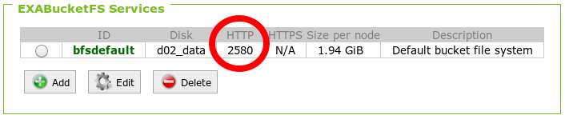
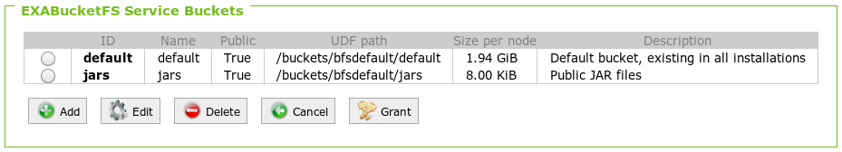

# Integration Testing with Containers

This integration test works fully automated, there are no manual steps in setting up the source database and the connection to EXASOL.

## Overview

The idea of the container based tests is:
* Run the EXASOL and source databases in containers
* Prepare the test schema in the source database
* Create a virtual schema for the source database
* Run the tests on the virtual schmema


## Prerequisites

What you need is, for each source database:

* A docker image with user you can connect to
* A JDBC driver for the database

## Preparing Integration Test

1. In order to run the integration test automated, edit the  [Travis CI integration test configuration file](../../../jdbc-adapter/integration-test-data/integration-test-travis.yaml) and add your new database.
2. Provide a JDBC driver JAR for the source database.
3. Add a new Integration Test class for you database

### Add Your Database to the Test Configuration
Set the following properties for your database:

| Configuration property   | Explanation | Example |
|--------------------------|-------------|---------|
| `runIntegrationTests`    | enable/disable your test | `true` |
| `jdbcDriverPath`         | path to the JDBC driver in bucketFS | `/buckets/bfsdefault/default/drivers/jdbc/POSTGRESQL/postgresql-42.2.5.jar`|
| `connectionString`       | connection string to connect to the source database from the integration test system, so use the exposed port | `jdbc:postgresql://localhost:45432/postgres` |
| `user`                   | the database user | |
| `password`               | password for the database user| |
| `dockerImage`            | name of the docker image for the source database | |
| `dockerImageVersion`     | version of the used docker image | `latest` |
| `dockerPortMapping`      | docker port mapping `<external_db_port>:<internal_db_port>` | `45432:5432` |
| `dockerName`             | name for the docker container < `testpg` |
| `dockerConnectionString` | connection string to connect to the source database from the EXASOL docker container. Use the constant `DBHOST` as hostname, this will be set to the actual internal docker network IP by the integration test script during runtime | `jdbc:postgresql://DBHOST:5432/postgres` |

### Provide JDBC drivers for the Source Database

The JDBC drivers are automatically deployed during the test. You have to create a directory for the jdbc driver under integration-test-data/drivers. The folder contains the driver jar file(s) and a config file. See the [PostgreSQL config](../../../jdbc-adapter/integration-test-data/drivers/POSTGRESQL/settings.cfg) for an example.

In order to connect to the source database from your integration test you also have to add the jdbc driver dependency to the [POM](../../../jdbc-adapter/virtualschema-jdbc-adapter/pom.xml) scope verify.

### Add a new Integration Test Class

Add a new class that derives from [AbstractIntegrationTest](../../../jdbc-adapter/virtualschema-jdbc-adapter/src/test/java/com/exasol/adapter/dialects/AbstractIntegrationTest.java). This class has to:
* Create the test schema in the source database
* Create the virtual schema
* Execute the tests on the virtual schema
See [PostgreSQLDialectIT](../../../jdbc-adapter/virtualschema-jdbc-adapter/src/test/java/com/exasol/adapter/dialects/postgresql/PostgreSQLSqlDialectIT.java) for an example.

## Executing Integration Tests

Executing the integration test is easy, just run the [integration test bash script](../../../jdbc-adapter/integration-test-data/run_integration_tests.sh)

# Integration Testing Against a Local Database

If you don't have a container for the source database, you can test against a local database

## Security Considerations

Please note that in the course of the integration tests you need to provide the test framework with access rights and credentials to the source database. 

In order not to create security issues:

* Make sure the data in the source database is not confidential (demo data only)
* Don't reuse credentials
* Don't check in credentials

## Prerequisites

* Exasol running
* Exasol accessible from within integration test environment
* Source database running
* Source database accessible from within integration test environment
* Test data loaded into source database
* [BucketFS HTTP port listening and reachable](https://www.exasol.com/support/browse/SOL-503?src=confmacro) (e.g. on port 2580)

  
  
* Bucket on BucketFS prepared for holding JDBC drivers and virtual schema adapter

  

* JDBC driver JAR archives available for databases against which to run integration tests

If BucketFS is new to you, there are nice [training videos on BucketFS](https://www.exasol.com/portal/display/TRAINING/BucketFS) available.

## Preparing Integration Test

1. Create a dedicated user in the source database that has the necessary access privileges 
2. Create credentials for the user under which the integration tests run at the source
3. Make a local copy of the [sample integration test configuration file](../../../jdbc-adapter/integration-test-data/integration-test-sample.yaml) in a place where you don't accidentally check this file in.
4. Edit the credentials information
5. [Deploy the JDBC driver(s)](../../user-guide/deploying_the_virtual_schema_adapter.md#deploying-jdbc-driver-files) to the prepared bucket in Exasol's BucketFS       

## Creating Your own Integration Test Configuration

Directories called `local` are ignored by Git, so you can place your configuration there and avoid having it checked in.

In the root directory of the adapter sources execute the following commands:

```bash
mkdir jdbc-adapter/local
cp jdbc-adapter/integration-test-data/integration-test-sample.yaml jdbc-adapter/local/integration-test-config.yaml
```

Now edit the file `jdbc-adapter/local/integration-test-config.yaml` to adapt the settings to your local installation.

## Executing Integration Tests

We use following [Maven life cycle phases](https://maven.apache.org/guides/introduction/introduction-to-the-lifecycle.html) for our integration tests:

* `pre-integration-test` phase is used to **automatically deploy the latest [JDBC](https://www.exasol.com/support/secure/attachment/66315/EXASOL_JDBC-6.1.rc1.tar.gz) adapter JAR** (based on your latest code modifications)
* `integration-test` phase is used to execute the actual integration tests

Note that to check whether the integration-tests were successful, you have to run the verify Maven phase.

You can start the integration tests as follows:

```bash
mvn clean package && mvn verify -Pit -Dintegrationtest.configfile=/path/to/your/integration-test-config.yaml
```

This will run all integration tests, i.e. all JUnit tests with the suffix `IT` in the filename.

The YAML configuration file stores the information for your test environment like JDBC connection strings, paths and credentials.

## See also

* [Developing an SQL dialect](developing_a_dialect.md)
* [Remote debugging](../remote_debugging.md)
* [Versioning](../versioning.md)