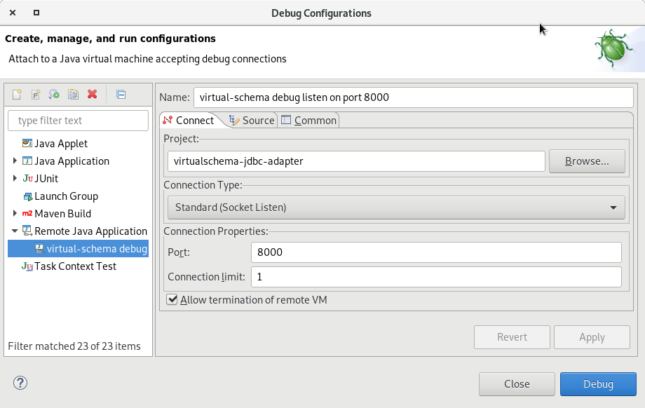

# Remote Debugging

Debugging a Virtual Schema Adapter running on an Exasol cluster usually requires remote debugging. Because typically the debugger is not run directly on the cluster node itself and more importantly not inside the container in which the Virtual Schema Adapter runs.

Consequently you need to establish a network connection between the Java virtual machine that runs the adapter and the [Java Debugger (jdb)](https://docs.oracle.com/javase/8/docs/technotes/tools/windows/jdb.html).

In this article you will learn how to:

1. Start the Java debugger in "listen mode" on your machine
1. Set up the Java VM to attach to a remote debugger

## Java Debugger &mdash; Client and Server

If you debug a Java application locally on your machine, the roles are clear: the Java VM is the "server" and the debugger user interface the "client".

In the diagram below you see such a regular "forward connection"

    .-------------------------.
    |       Cluster node       |
    |  .--------------------.  |              .--------------------.
    |  |   UDF container    |  |              | Developer machine  |  
    |  |  .--------------.  |  |              |  .--------------.  |
    |  |  |   Java VM    |  |  |  network     |  |     JDB      |  |
    |  |  |              o<-o<-o<----------------|              |  |
    |  |  | Debug server |  |  |  connection  |  | Debug client |  |
    |  |  '--------------'  |  |              |  '--------------'  |
    |  '--------------------'  |              '--------------------'
    '--------------------------'

With remote debugging you can switch the roles &mdash; and that is in fact often the better choice.

If the debug server is on the side of the Virtual Schema, that means you need to get incoming network connections through to the node the cluster is running on and then into the container. Both are not trivial and often outside of a regular users control. Port forwarding for example requires administrator privileges.

If you turn the roles of client and server around, then the Java VM that runs the Virtual Schema creates an outgoing connection and that is in typical network scenarios a standard case.

    .-------------------------.
    |       Cluster node       |
    |  .--------------------.  |              .--------------------.
    |  |   UDF container    |  |              | Developer machine  |  
    |  |  .--------------.  |  |              |  .--------------.  |
    |  |  |   Java VM    |  |  |  network     |  |     JDB      |  |
    |  |  |              |---------------------->o              |  |
    |  |  | Debug client |  |  |  connection  |  | Debug server |  |
    |  |  '--------------'  |  |              |  '--------------'  |
    |  '--------------------'  |              '--------------------'
    '--------------------------'          listening on port

Given that the developer machine is reachable from the cluster node &mdash; which in integration tests environments often is the case &mdash; this setup is more robust.

## Starting the Java Debugger in Listen Mode

This section explains how to start the user-facing part of the Java Debugger in listen-mode.

### Starting the Command Line JDB in Listen Mode

The following command starts the command line JDB in listen mode

```bash
jdb -listen 8000
```

### Starting the Eclipse Java Debugger in Listen Mode

You are not limited to the command line JDB. All modern IDEs that include the Java Debugger have a means of configuring the debugger in listen mode. In this example we will use the [debugger built into the Eclipse IDE](https://www.eclipse.org/community/eclipse_newsletter/2017/june/article1.php).

1. In the Menu click "Run"
1. Click "Debug Configurations..."
1. In dialog "Debug Configurations
    1. Select the entry "Remote Java Application"
    1. Click "New launch configuration" (white paper icon)
    1. In "Project" enter "virtual-schema-jdbc-adapter"
    1. In "Connection Type" select "Standard (Socket Listen)"
    1. In "Connection Properties" choose a port that is not in use on your machine (e.g. 8000)
    1. Check the box "Allow termination of remote VM"

You can see the filled out configuration dialog below.



You can find the example configuration above in the collection of launch configurations under [`jdbc-adapter/launch`](../../launch/virtual-schema%20debug%20listen%20on%20port%208000.launch). 

## Configuring the Virtual Schema for Remote Debugging

In this section you will see how to set up the Virtual Schema so that you can run a remote debugger in parallel while executing the Virtual Schema Adapter.

### Configuring the Virtual Schema to Establish a Reverse Connection for Debugging

Debug options need to be set when creating a virtual schema. Below you see an example of what you have to add compared to a regular virtual schema creation if you want remote debugging with a reverse connection. 

```sql
CREATE OR REPLACE JAVA ADAPTER SCRIPT ADAPTER.ATHENA_ADAPTER AS
  %jvmoption -agentlib:jdwp=transport=dt_socket,server=n,address=<host>:<port>,suspend=y;
  -- ...
/
```

The parameter `jvmoption` is passed down to the Java VM that runs the Virtual Schema.

Here's what the parts of those VM options mean:

| Parameter                            | Meaning                                                         |
|--------------------------------------|-----------------------------------------------------------------|
| `agentlib:jdwp=transport=dt_socket`  | Use the [Java Debug Wire Protocol](https://docs.oracle.com/javase/8/docs/technotes/guides/jpda/jdwp-spec.html) over a socket connection |
| `server=n`                           | Switches the VM side of the debugging chain to client mode      |
| `address=<host>:<port>`              | Host name or IP address and port of the debugger in listen mode |
| `suspend=y`                          | Establish the debug connection before running the program       |

## The Debugging Session

Once your debugger is listening and the adapter script configuration is properly set, you can start the actual debugging.

### Setting a Breakpoint

One of the most common mistakes when trying this out the first time is to forget setting a breakpoint. If you do this, then the Java VM inside the language container will connect to you debugger, but the adapter script will simply run through.

If you want to do real debugging, you need at least on breakpoint before you start.

Please refer to the documentation of your IDE or the Java debugger to learn how to set a breakpoint.

## Troubleshooting

### `JAVA_TOOL_OPTIONS` is Deprecated

Earlier versions of Virtual Schema were based on Java 8. At that time you could set the environment variable [`JAVA_TOOL_OPTIONS`](https://docs.oracle.com/javase/8/docs/technotes/guides/troubleshoot/envvars002.html) to define the debugger options.

Recent releases use Java 11 and that variant does not work anymore. Use `%jvmoptions` instead.

### "VM crashed" After First Successful Debug Session

If you want to work in a implement-debug cycle, make sure your debugger settings keep the debugger listening after the remote VM finished. Otherwise you will get a "VM crashed" error that is caused by the VM not being able to attach to the remote debugger because it is not listening. 