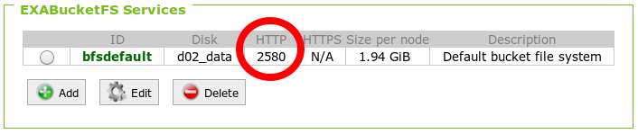
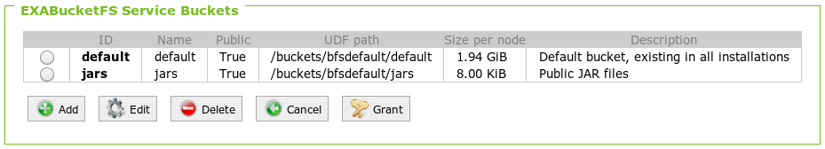

# How To Develop and Test a Dialect
This page describes how you can develop and semi-automatically test a dialect for the JDBC adapter. The framework for testing a dialect is still work in progress.

## Content

* [Developing a Dialect](#developing-a-dialect)
* [Integration Testing](#integration-testing)

## Developing a Dialect

You can implement a dialect by implementing the interface `com.exasol.adapter.dialects.SqlDialect`.
We recommend to look at the following resources to get started:

* First have a look at the [SqlDialect interface source code](../virtualschema-jdbc-adapter/src/main/java/com/exasol/adapter/dialects/SqlDialect.java). You can start with the comments of the interface and have a look at the methods you can override.
* Second you can review the source code of one of the [dialect implementations](../virtualschema-jdbc-adapter/src/main/java/com/exasol/adapter/dialects/impl) as an inspiration. Ideally you should look at the dialect which is closest to your data source.

To implement a full dialect for a typical data source you have to run all of the following steps. We recommend to follow the order proposed here.

### Registering the Dialect

The Virtual Schema adapter creates an instance of an SQL dialect on demand. You can pick any dialect that is listed in the `SqlDialects` registry.

To register your new dialect add it to the list in [sql_dialects.properties](../virtualschema-jdbc-adapter/src/main/resources/sql_dialects.properties]).

```properties
com.exasol.adapter.dialects.supported=\
...
com.exasol.adapter.dialects.impl.MyAweSomeSqlDialect
```

For tests or in case you want to exclude existing dialects in certain scenarios you can override the contents of this file by setting the system property `com.exasol.adapter.dialects.supported`.

Please also remember to [list the supported dialect in the documentation](../README.md).

### Setup Data Source

* Setup and start the database
* Testdata: Create a test schema with a simple table (simple data types)

### Setup Exasol

* Setup and start an Exasol database with virtual schemas feature
* Upload the JDBC drivers of the data source via EXAOperation
* Manual test: query data from the data source via `IMPORT FROM JDBC`

### Catalog, Schema & Table Mapping

* Override the `SqlDialect` methods for catalog, schema and table mapping
* Manual test: create a virtual schema by specifying the catalog and/or schema.

### Data Type Mapping

* Testdata: Create a table with all data types and at least one row of data
* Override the `SqlDialect` method for data type mapping
* Automatic test: sys tables show virtual table and columns with correctly mapped type
* Automatic test: running `SELECT` on the virtual table returns the expected result

### Identifier Case Handling & Quoting

* Testdata: Create a schema/table/column with mixed case (if supported)
* Automatic test: sys tables correct
* Automatic test: `SELECT` works as expected

### Projection Capability

* Add capability
* Automatic test: pushed down & correct result (incl. `EXPLAIN VIRTUAL`). Also test with mixed case columns.

### Predicates and Literal Capabilities

* Add capabilities for supported literals and predicates (e.g. `c1='foo'`)
* Automatic test: pushed down & correct result (incl. `EXPLAIN VIRTUAL`) for all predicates & literals

### Aggregation & Set Function Capabilities

* Add capabilities for aggregations and aggregation functions
* Automatic test: pushed down & correct result (incl. `EXPLAIN VIRTUAL`) for all set functions

### Order By / Limit Capabilities

* Testdata: Create a table with null values and non-null values, to check null collation.
* Add capabilities for order by and/or limit
* Automatic test: pushed down & correct result (incl. `EXPLAIN VIRTUAL`)
* Automatic test: default null collation, explicit `NULLS FIRST/LAST`

### Scalar Function Capabilities

* Add capabilities for scalar functions
* Automatic test: pushed down & correct result (incl. `EXPLAIN VIRTUAL`)

### Views

* Testdata: Create a simple view, e.g. joining two existing tables
* Automatic test: Query the view, optionally e.g. with a filter.

## Integration Testing

### Security Considerations

Please note that in the course of the integration tests you need to provide the test framework with access rights and credentials to the source database. 

In order not to create security issues:

* Make sure the data in the source database is not confidential (demo data only)
* Don't reuse credentials
* Don't check in credentials

### Prerequisites

* Exasol running
* Exasol accessible from within integration test environment
* Source database running
* Source database accessible from within integration test environment
* Test data loaded into source database
* [BucketFS HTTP port listening and reachable](https://www.exasol.com/support/browse/SOL-503?src=confmacro) (e.g. on port 2580)

  
  
* Bucket on BucketFS prepared for holding JDBC drivers and virtual schema adapter

  

* JDBC driver JAR archives available for databases against which to run integration tests

If BucketFS is new to you, there are nice [training videos on BucketFS](https://www.exasol.com/portal/display/TRAINING/BucketFS) available.

### Preparing Integration Test

1. Create a dedicated user in the source database that has the necessary access privileges 
2. Create credentials for the user under which the integration tests run at the source
3. Make a local copy of the [sample integration test configuration file](../integration-test-data/integration-test-sample.yaml) in a place where you don't accidentally check this file in.
4. Edit the credentials information
5. [Deploy the JDBC driver(s)](deploying_the_virtual_schema_adapter.md#deploying-jdbc-driver-files) to the prepared bucket in Exasol's BucketFS       

#### Creating Your own Integration Test Configuration

Directories called `local` are ignored by Git, so you can place your configuration there and avoid having it checked in.

In the root directory of the adapter sources execute the following commands:

```bash
mkdir jdbc-adapter/local
cp jdbc-adapter/integration-test-data/integration-test-sample.yaml jdbc-adapter/local/integration-test-config.yaml
```

Now edit the file `jdbc-adapter/local/integration-test-config.yaml` to adapt the settings to your local installation.

### Executing Integration Tests

We use following [Maven lifecycle phases](https://maven.apache.org/guides/introduction/introduction-to-the-lifecycle.html) for our integration tests:

* `pre-integration-test` phase is used to **automatically deploy the latest [JDBC](https://www.exasol.com/support/secure/attachment/66315/EXASOL_JDBC-6.1.rc1.tar.gz) adapter JAR** (based on your latest code modifications)
* `integration-test` phase is used to execute the actual integration tests

Note that to check whether the integration-tests were successful, you have to run the verify Maven phase.

You can start the integration tests as follows:

```bash
mvn clean package && mvn verify -Pit -Dintegrationtest.configfile=/path/to/your/integration-test-config.yaml
```

This will run all integration tests, i.e. all JUnit tests with the suffix `IT` in the filename.

The YAML configuration file stores the information for your test environment like JDBC connection strings, paths and credentials.

## Observing Adapter Output

You can either use [netcat](http://netcat.sourceforge.net/) or `exaoutput.py` from the [EXASolution Python Package](https://github.com/EXASOL/python-exasol). Since netcat is available on most Linux machines anyway, we will use this in the description here.

First start netcat in listen-mode on a free TCP port on your machine.

```bash
nc -lkp 3000
```

The `-l` switch puts netcat into listen-mode. `-k` tells it to stay open after the peer closed a connection. `-p 3000` set the number of the TCP port netcat listens on.

Next find out your IP address.

Linux:

```bash
ip -br address
```

Windows:

```cmd
ipconfig /all
```

The next SQL command shows an example of declaring a virtual schema. Notice the IP address and port in the last line. This tells the adapter script where to direct the output to. 

```sql
CREATE VIRTUAL SCHEMA VS_EXA_IT
USING ADAPTER.JDBC_ADAPTER
WITH CONNECTION_STRING='jdbc:exa:localhost:8563' USERNAME='sys' PASSWORD='exasol'
     SCHEMA_NAME='NATIVE_EXA_IT' SQL_DIALECT='EXASOL' IS_LOCAL='true'
     DEBUG_ADDRESS='10.44.1.228:3000' LOG_LEVEL='ALL';
```

The parameter LOG_LEVEL lets you pick a log level as defined in [java.util.logging.Level](https://docs.oracle.com/javase/8/docs/api/java/util/logging/Level.html).

The recommended standard log levels are:

* `INFO` in production
* `ALL` for in-depth debugging

You can tell that the connection works if you see the following message after executing the SQL command that installs a virtual schema:

    Attached to output service

## Java Remote Debugging of Adapter script

When developing a new dialect it is sometimes really helpful to debug the deployed adapter script inside the database.
In a one node Exasol environment setting up remote debugging is straight forward.
First define the following `env` directive in your adapter script:

```sql
CREATE OR REPLACE JAVA ADAPTER SCRIPT adapter.jdbc_adapter 
  AS
  
  %env JAVA_TOOL_OPTIONS="-agentlib:jdwp=transport=dt_socket,server=y,address=8000,suspend=y";

  // This is the class implementing the callback method of the adapter script
  %scriptclass com.exasol.adapter.jdbc.JdbcAdapter;

  // This will add the adapter jar to the classpath so that it can be used inside the adapter script
  // Replace the names of the bucketfs and the bucket with the ones you used.
  %jar /buckets/bucketfs1/bucket1/virtualschema-jdbc-adapter-dist-1.2.0.jar;
									 
  // You have to add all files of the data source jdbc driver here (e.g. MySQL or Hive)

  %jar /buckets/bucketfs1/bucket1/RedshiftJDBC42-1.2.1.1001.jar;

/
```

In eclipse (or any other Java IDE) you can then attach remotely to the Java Adapter using the IP of your one node Exasol environment and the port 8000.

The switch `suspend=y` tells the Java-process to wait until the debugger connects to the Java UDF.

## Version Management

All dialects have the same version as the master project. In the master `pom.xml` file a property called `product-version` is set. Use this in as the artifact version number in the JDBC adapter and all dialects.

Run the script

```bash
jdbc-adapter/tools/version.sh verify
```

To check that all documentation and templates reference the same version number. This script is also used as a build breaker in the continuous integration script.

To update documentation files run

```bash
jdbc-adapter/tools/version.sh unify
```

Note that the script must be run from the root directory of the virtual schema project.

## Troubleshooting

### Setting the Right IP Addresses for Database Connections

Keep in mind that the adapter script is deployed in the Exasol database. If you want it to be able to make connections to other databases, you need to make sure that the IP addresses or host names are the ones that the database sees, not your local machine. This is easily forgotten in case of automated integration tests since it feels like they run on your machine -- which is only partially true.

So a common source of error would be to specify `localhost` or `127.0.0.1` as address of the remote database in case you have it running in Docker or a VM on your local machine. But the Exasol Database cannot reach the other database there unless it is running on the same machine directly (i.e. not behind a virtual network device).